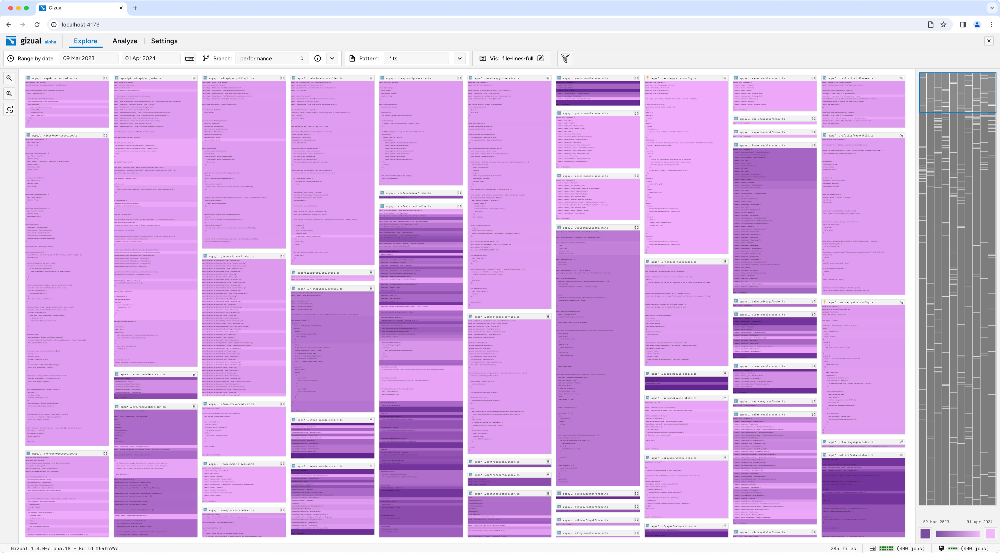

# Gizual

[](https://opensource.org/licenses/Apache-2.0)

Gizual (pronounced `/ˈgɪʒ.u.əl/`, a combination of the words "git" and "visual") is a tool to visualize Git repositories.  
A deployed live version of the project can be accessed at [gizual.com](https://www.gizual.com).



### Browser Compatibility

| Browser                      | Version | Release Date | FSA<sup>1</sup> | Drag & Drop | File Input | Remote Clone<sup>2</sup> |
| ---------------------------- | :-----: | :----------: | :-------------: | :---------: | :--------: | :----------------------: |
| Chromium<br/>(Chrome & Edge) |  106+   |   Sep. 22    |       👍        |     👍      |     👍     |            👍            |
| Firefox                      |  110+   |   Feb. 23    |       🚫        |     👍      |     👍     |            👍            |
| Safari<sup>3</sup>           |  16.4+  |   Mar. 23    |       🚫        |     👨‍💻      |     👨‍💻     |            👍            |
| Safari (iOS)<sup>3</sup>     |  17.0+  |   Sep. 23    |       🚫        |     🚫      |     🚫     |      🚧<sup>4</sup>      |
| Chrome (Android)             |  106+   |   Sep. 22    |       🚫        |     🚫      |     🚫     |            👍            |

[1]: FSA - [File System Access API](https://developer.mozilla.org/en-US/docs/Web/API/File_System_Access_API)  
[2]: Remote Clone - Remote cloning via server proxy from public repos on GitHub.  
[3]: Safari - Only supported if private browsing is disabled.  
[4]: Safari (iOS) - Gizual, being memory and CPU intensive, frequently crashes due to system limitations despite technical support.

👍 Works as intended  
🚧 Partial support / unstable  
👨‍💻 Work in progress  
🚫 Not supported

---

### How to run locally?

We recommend using Docker for running the project locally. If you don't have Docker installed, you can follow the manual installation steps.

#### via Docker Image

::warning:: A secure context is required for Gizual to work. This means you need to access the Docker container from a secure context, either via HTTPS or via `localhost`.

```bash
docker run -p 7172:7172 --name gizual ghcr.io/gizual/gizual:v1.0.0-alpha.20
# You can now open http://localhost:7172
```

#### Manual

Ensure the required dependencies are installed. (Git, Rust, Node.js v18, yarn). For Windows, check the [docs](./docs/dep-install-windows.md).

```bash
git clone https://github.com/gizual/gizual.git
cd gizual

yarn            # install dependencies

yarn build      # run build for production
yarn preview    # preview production build at http://localhost:4173
```

---

### How to contribute?

Since we are still in the early stages of development things change rapidly. As such, we recommend reaching out by creating an issue before starting work on a feature or a bug fix.

```bash
git clone https://github.com/gizual/gizual.git
cd gizual

yarn            # install dependencies
yarn dev        # runs server at http://localhost:5173
```

---

### Academic Background

This project was developed as part of the following two Master's theses at [Graz University of Technology](https://tugraz.at).

Gizual Data Layer: Enabling Browser-Based Exploration of Git Repositories (Stefan Schintler, 2024) - [Thesis](https://ftp.isds.tugraz.at/pub/theses/sschintler-2024-msc.pdf)

```bibtex
@mastersthesis{schintler2024gizual,
  title     = "Gizual Data Layer: Enabling Browser-Based Exploration of Git Repositories",
  author    = "Stefan Schintler",
  date      = "2024-12-09",
  school    = "Graz University of Technology, Austria",
  url       = "https://ftp.isds.tugraz.at/pub/theses/sschintler-2024-msc.pdf"
}
```

Gizual User Interface: Browser-Based Visualisation for Git Repositories (Andreas Steinkellner, 2024) - [Thesis](https://ftp.isds.tugraz.at/pub/theses/asteinkellner-2024-msc.pdf)

```bibtex
@mastersthesis{steinkellner2024gizual,
  title     = "Gizual User Interface: Browser-Based Visualisation for Git Repositories",
  author    = "Andreas Steinkellner",
  date      = "2024-12-09",
  school    = "Graz University of Technology, Austria",
  url       = "https://ftp.isds.tugraz.at/pub/theses/asteinkellner-2024-msc.pdf"
}
```

Additional resources / slides / talks can be found on [our website](https://gizual.com/resources).
