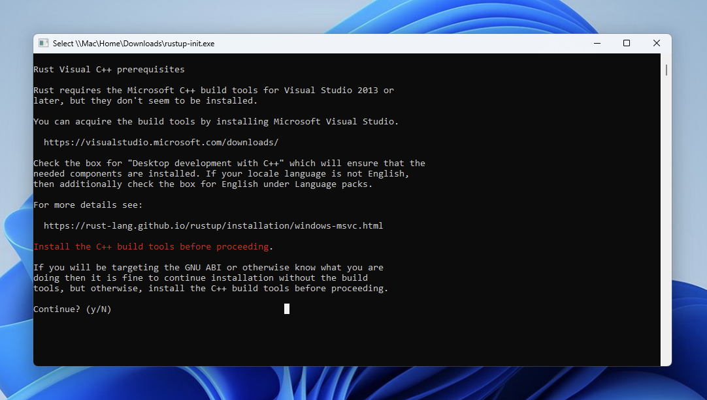
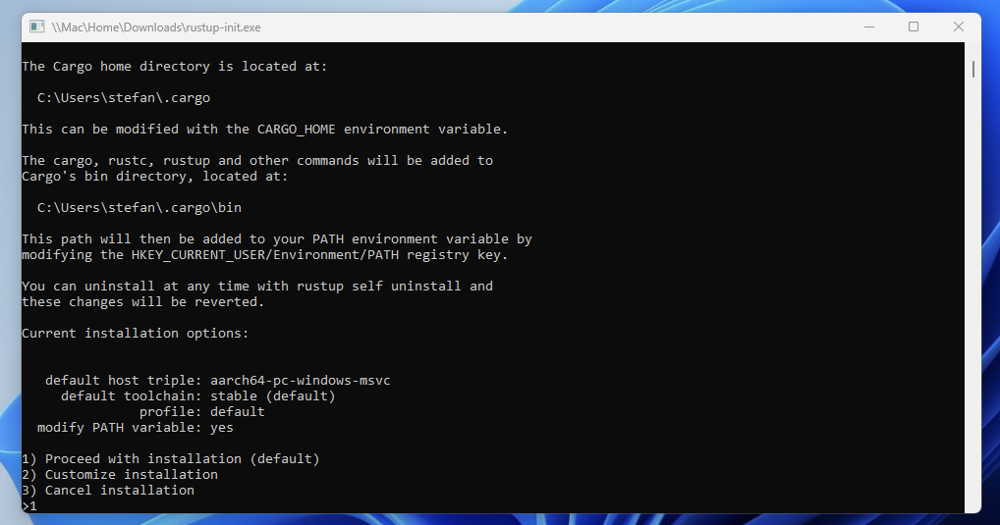

# How to install required dependencies on Windows

## Git

1. Available at https://git-scm.com/downloads

## Node.js

1. Install Node.js v18 (tested with: v18.17.1) \
   Installer: https://nodejs.org/en/download \
   Path: C:\Program Files\nodejs\

2. Install yarn

   ```bash
   npm install -g yarn
   ```

3. If PowerShell is used, enable execution
   ```pwsh
   Set-ExecutionPolicy -Scope CurrentUser -ExecutionPolicy Unrestricted
   ```

## Rust

1. Install Rust (64-bit, tested with 1.79.0) \
   Installer: https://www.rust-lang.org/tools/install

   a. continue without visual c++ (y)
   

   b. Use the default settings
   
